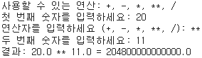
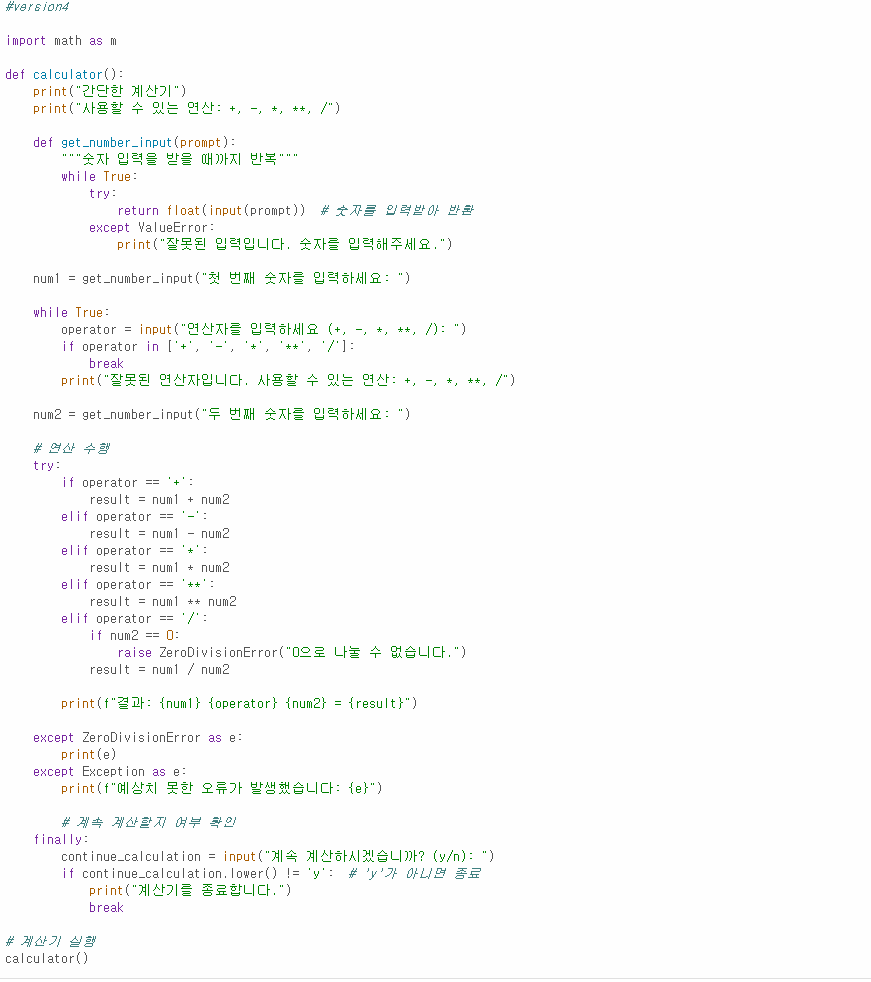

# AIFFEL Campus Online Code Peer Review Templete  
- 코더 : 이지선  
- 리뷰어 : 김민상  


# PRT(Peer Review Template)  
- [X]  **1. 주어진 문제를 해결하는 완성된 코드가 제출되었나요?**  
    - 내가 뭘 입력했는지와 어떤 과정으로 결과가 나왔는지까지 나오는 모습이이해하기 쉬웠다  
    - 결과물이 잘 나왔다   
  
    
- [ ]  **2. 전체 코드에서 가장 핵심적이거나 가장 복잡하고 이해하기 어려운 부분에 작성된   
주석 또는 doc string을 보고 해당 코드가 잘 이해되었나요?**  
    - 해당 코드 블럭을 왜 핵심적이라고 생각하는지 확인  
    - 해당 코드 블럭에 doc string/annotation이 달려 있는지 확인  
    - 해당 코드의 기능, 존재 이유, 작동 원리 등을 기술했는지 확인  
    - 주석을 보고 코드 이해가 잘 되었는지 확인  
        - 중요! 잘 작성되었다고 생각되는 부분을 캡쳐해 근거로 첨부  
        
- [X]  **3. 에러가 난 부분을 디버깅하여 문제를 해결한 기록을 남겼거나  
새로운 시도 또는 추가 실험을 수행해봤나요?**  
    - 실패한 과정을 남겨놔서 어떤부분에서 문제가 발생햇는지 볼수 있는 부분이 좋았다  
  
        
- [X]  **4. 회고를 잘 작성했나요?**  
    - 회고에서 부족한 부분을 인지하고 도움을 받는것에 거부감없이 진행한 모습이 좋았다  
  
        
- [ ]  **5. 코드가 간결하고 효율적인가요?**  
    - 파이썬 스타일 가이드 (PEP8) 를 준수하였는지 확인  
    - 코드 중복을 최소화하고 범용적으로 사용할 수 있도록 함수화/모듈화했는지 확인  
        - 중요! 잘 작성되었다고 생각되는 부분을 캡쳐해 근거로 첨부  


# 회고(참고 링크 및 코드 개선)  
```
김민상: 나와는 다른방법이 있는걸 알았다.
나는 구글링을 계속했는데 구글링 말고도 ai에게 도움을 받을수 있음을 깨달았다.
마지막에 lower을 사용하셨는데 난 사용하지않아서 대문자를 입력받으면 작동하지 않는것을 알았다.
math 모듈을 가져와서 사용하지 않은부분이 아쉬웠다.
```  
